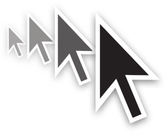

<p align="center">
    
</p>

[](https://github.com/krystianhub/StayAwake/actions)
[](https://crates.io/crates/stayawake)
[](https://github.com/krystianhub/StayAwake/blob/master/LICENSE)

# StayAwake

## Introduction

StayAwake is a simple program for Windows & MacOS to keep your system awake without affecting your workflow.

Inspired by [stay-awake](https://pypi.org/project/stay-awake/) package for Python.

As with the Python package the program is only triggered when you don't do any mouse movements and it is completely headless (it is intended to be used as a command line tool).

### How does it work?

If in a span of **60** seconds you don't move your mouse, this program will automatically move your mouse for about **5** to **15** pixels randomly. There won't be any mouse displacement! If you are working, this will do absolutely nothing!

All settings like the time interval or the range of random mouse movement is fully customizable via environment variables or **[.env](.env)** file.

## Installation

You can download the [latest version](https://github.com/krystianhub/StayAwake/releases/latest) from Github Releases.

Alternatively, you can install it via **cargo** command:

```bash
cargo install stayawake
```

## Configuration

Binary comes with a default configuration. However, it can be overridden by creating **[.env](.env)** file in the same location as the binary itself.

There are only 4 available configuration properties:

```properties
RUST_LOG=INFO # logging level
STAYAWAKE_INTERVAL=15 # in seconds
JUMP_BY_PIXEL_MIN=100 # in pixels
JUMP_BY_PIXEL_MAX=150 # in pixels
WORKING_AREA=1024x768 # in pixels, operating window area (usually your display resolution; for example, 1024x768)
```
